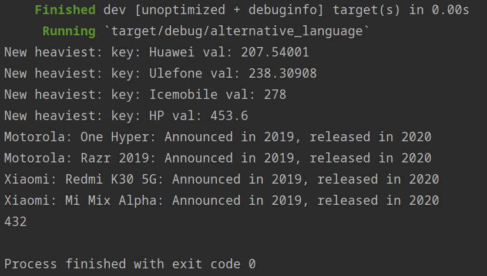

# Alternative Language Project: Rust

## Introduction
I selected Rust for this project because it's a language that's caught my attention because of a combination of performance, safety, and general language appreciation as seen in Rust consistently doing well in stackoverflow surveys. I first started exploring Rust in December, so it's not 100% new to me, but I'm still very much a novice with the language and this assignment dealt with topics that I haven't explored on my own. There were also a lot of areas I would have liked to spend more time to figure out the best way to do the task using Rust, but logistically didn't have time. As for the version, it was 1.6x, which was the most recent version until 1.7 came out less than a week ago.

## Elements of the Language

### OOP
Rust handles Object Oriented Programming ideas in a somewhat piece-meal way, far from what one may consider traditional compared to a language like Java. Indeed, there are arguments that Rust is not an OOP language. Rust's closest equivalent to objects comes from using Structs to group related information and behavior. Methods associated with a struct are declared separately. Traits are a way of declaring shared behavior across different structs, similar (in some ways) to Java's interfaces.

### File Ingestion
Rust has a very robust standard library with great and simple file reading abilities included. Combined with functions like map and filter, an entire file can be read and processed in linear time using only a couple lines of code. However, once I realized the fields with String type might have commas, I decided to simplify my life by using a dedicated CSV parsing library.

### Conditional Statements
Rust has the usual suspects of "if '', "while", et cetera. The notation for these is fairly self evident when seen ("if '' followed by something that evaluates to a boolean), though there are some quirks that show up as you go deeper and ways they can be used not found in languages like Java. One related area where Rust stands out is it's match statements, which are analogous to switch statements in other languages but *significantly* more robust than the switch statements I've seen in other languages. In the interest of personal speed, I used match statements throughout this assignment, when honestly other alternatives would be better, and I didn't showcase how powerful it can be.

### Assignment Statements
Rust uses the let keyword to declare a variable and a "=" to assign a value. The Rust compiler is very good at determining the type the variable should be, but this can be explicitly declared by using a ":" after the variable name and before the "=" assignment. In some cases, Rust will parse the passed expression differently because of this. Rust also supports conditional declarations (something I didn't use). One very important note, variables in Rust are *immutable* by default, they must be explicitly declared as mutable (`let mut var`). Finally, Rust uses lifetimes as an alternative to garbage collection. The compiler is very good at determining lifetimes, especially for simpler variables, but sometimes it must be declared separately. Fortunately, this was not required in this assignment.

### Loops
Rust supports `for` loops and `while` loops. Rust also has a `loop` function that simply loops until it is escaped via a break or return; this is surprisingly useful. For loops in Rust have some interesting functionality, but internally seem to use an iterator that prevents them from being used in some of the ways for loops can be used in a language like Java. Relatedly, Rust uses a *lot* of iterators, both explicitly and internally.

### Subprograms
Functions are declared by the keyword `fn` followed by the function name, an optional type declaration for generics, the list of parameters as the name followed by the type, and finally an optional return value.
`
fn make_phone_vec<R>(mut reader: Reader<R>) -> Vec<Cell> where R: std::io::Read{}
`
Methods are declared the same way, but inside a block of code labeled with `impl` and the name of the associated struct. Of important note for larger programs, functions are *not* public by default, they must be explicitly declared as such.

### Unit Tests
Testing is built into the language by declaring tests and calling `cargo test` from the command line.

### Exception Handling
Exceptions are interesting, because a lot of errors are implicitly dealt with, with the result being returned in the form of a Result or Option, and triggering an actual error requires explicit ignoring this (typically by hard coding an action that assumes a success). Not shown in my assignment, Rust has a macro (a function with special quickhand notation) `panic!` that is similar to throwing a new exception in Java. It is recommended to use panic! for debugging, and Result for catching and responding to errors.

## Libraries
I used the csv library (crate) to parse the file. Originally I was manually parsing, but the String fields complicated that, and it was much easier to figure out how this worked than parsing every String field. This was the only library I used that wasn't in the Rust standard library.

I also used the HashMap module, which is part of the Rust standard library, as a way to organize some data when processing, such as the number of phones released in a year.

## Data Results

HP has the heaviest average device weight at 453.6 grams, probably because it lists a single tablet, rather than phones.

There were at least four phones announced in one year and released in another:

	Motorola One Hyper

	Motorola Razr

	Xiaomi Redmi K30 5G

	Xiaomi Mi Mix Alpha

Some release years are included in the announced field, and my program doesn't deal with that, so there may be others that were missed.

There are 432 phones with only one feature or sensor listed, mostly "V1".

The busiest year was 2019, with 299 phones released. As with other questions involving years, my parsing is limited. However, that's nearly a third of the phones in the list, so it's likely to be the correct year, even if the value is off.

